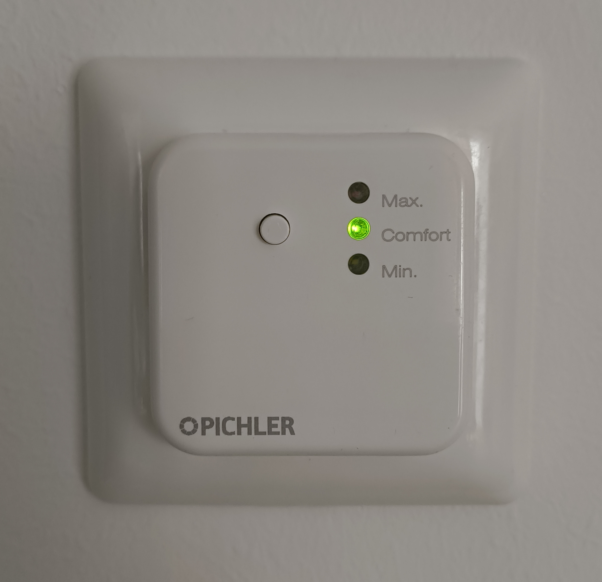
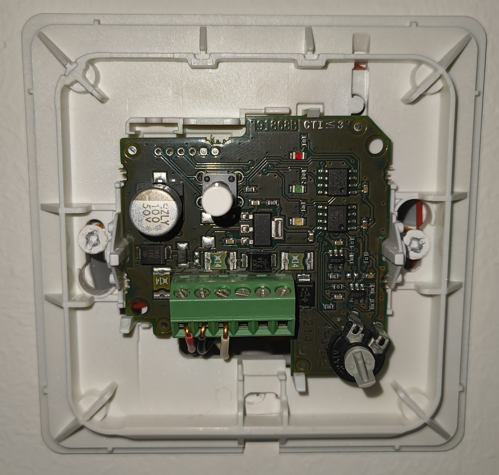
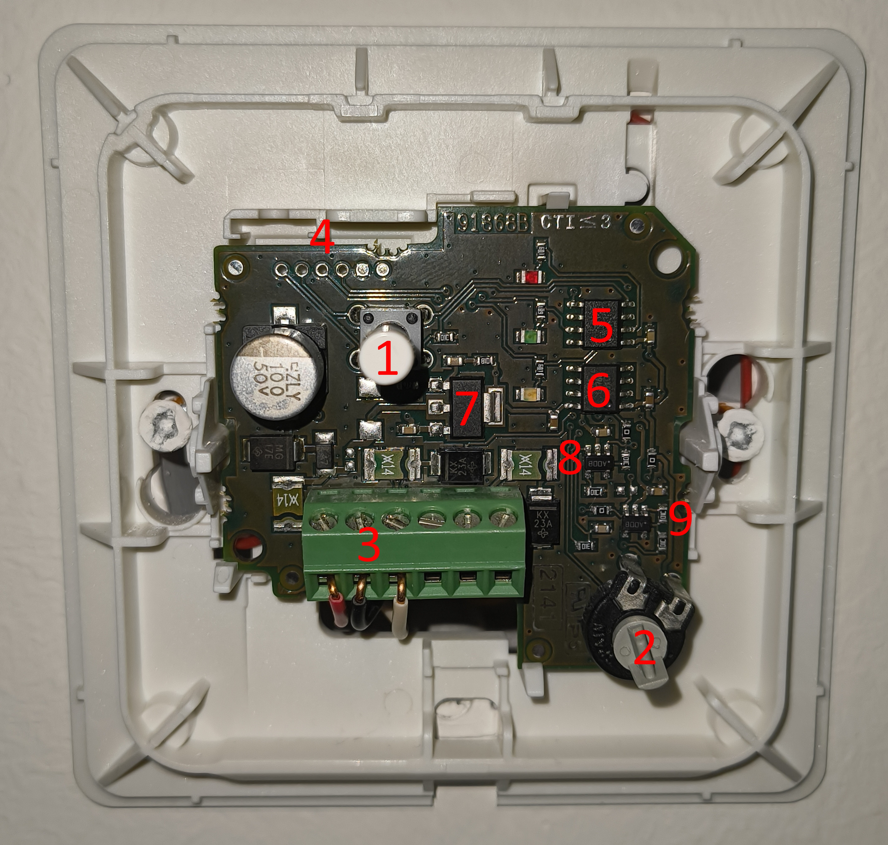
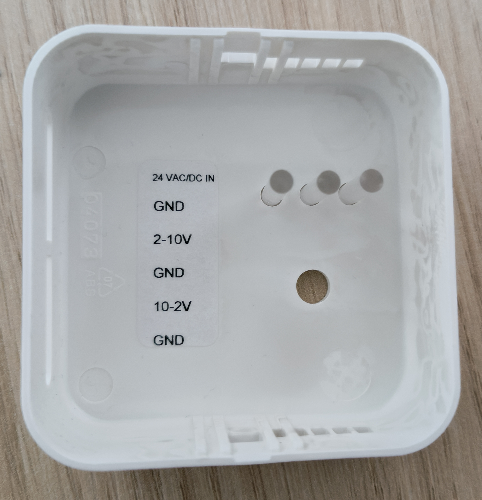
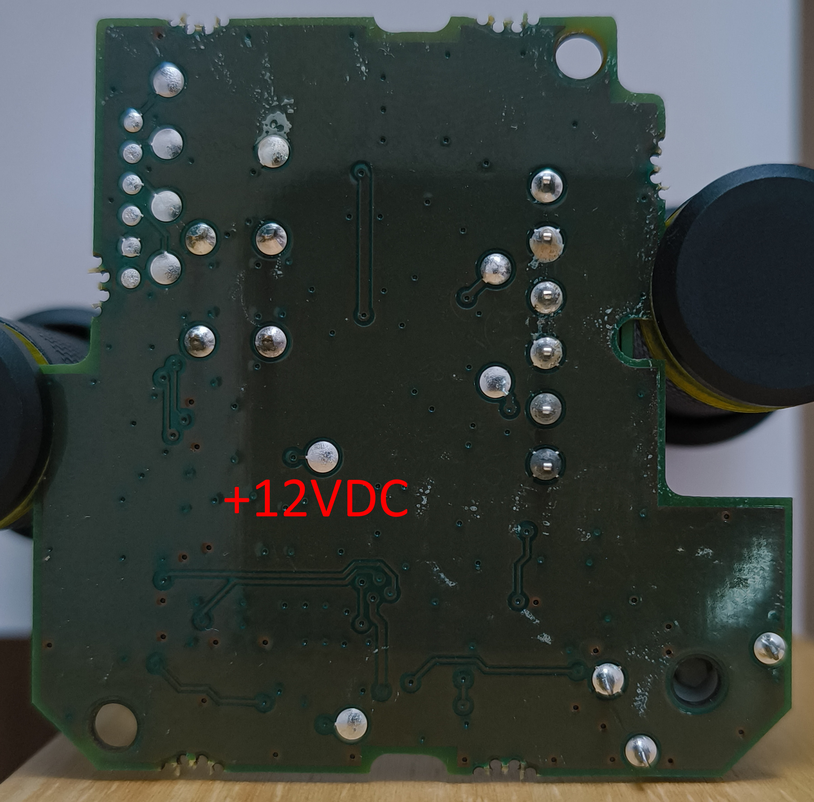
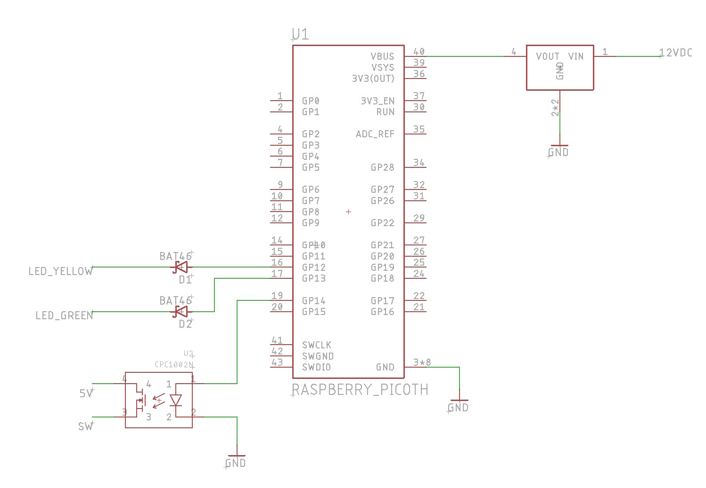
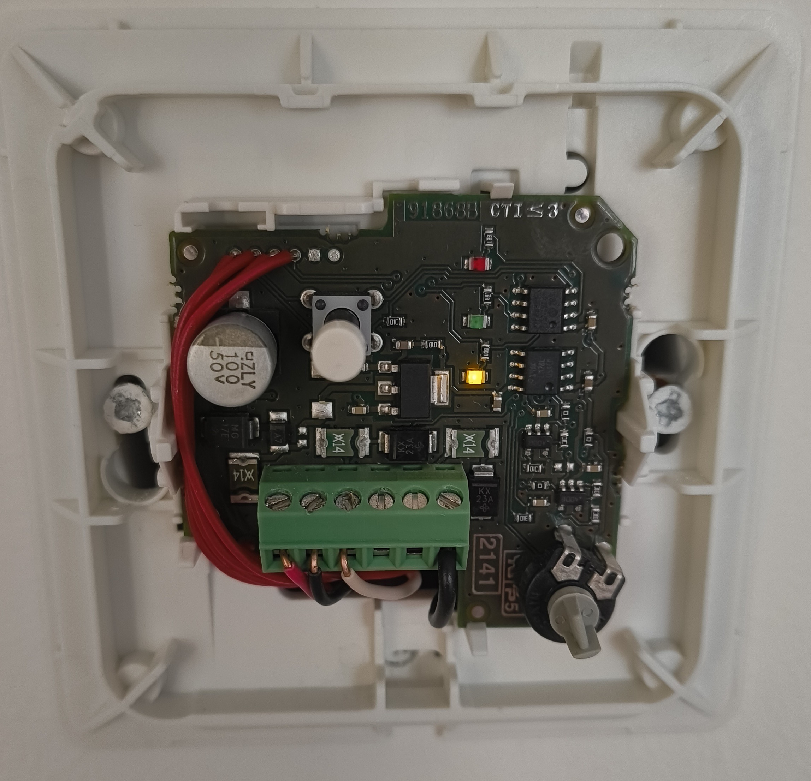
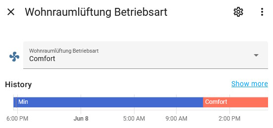

# Home Assistant Integration for a Non-Smart Housing Ventilation Controller

This repo describes how I integrated my non-smart housing ventilation controller into Home Assistant.

## Initial State

My apartment has a housing ventilation system from [Pichler](https://www.pichlerluft.at/products.html), similar to the [VAV-USB-BOX](https://www.pichlerluft.at/volume-flow-controllers-with-silencers.html?file=files/content/_ENGLISCH/Download/tecnical%20data%20sheet/10VAV-USD-Box-VAV-USD-SLU-Box_HY_English.pdf).
The whole ventilation system is controlled with a simple wall-mounted controller (see picture below), which is used to select the operating level (Minimum, Comfort, Maximum).
The controller is a [Pichler WRR3A2](https://www.pichlerluft.at/unterlagen.html?file=files/content/downloads/Komfortlueftung/Endkunde/08Anleitung_Wohnraumregler_WRR3A2.pdf) (unfortunately Pichler only provides a german manual, but since Pichler is primarily based in Austria and Germany, this should not be a problem).

## The Problem

Since this controller does not offer any MQTT integration, or other smart functions, I looked into how to implement a simple solution to control the ventilation system in Home Assistant.

These are my requirements for the new solution:

-   Manual control still possible
-   No external mains power supply necessary (because there is none available in the in-wall pattress)
-   Home Assistant integration to control the state

### Findings

The current controller has a 24V AC/DC input for power, a 2-10 VDC controlling output, and a 10-2 VDC inverted controlling output.

The simplest solution would probably have been to just remove the current controller, and install a simple smart LED controller with a 2-10 VDC output.

However, this would have several disadvantages:

-   LED controllers typically have a 230 VAC mains input, which I don't have
-   LED controllers are pretty large, and wouldn't have fit into the in-wall pattress box
-   LED controllers typically don't have a manual switch
-   using a LED controller wouldn't have been as much fun
-   I wanted to learn how the current controller works

## Current Controller

| Label | Description                                                                                 |
| ----- | ------------------------------------------------------------------------------------------- |
| 1     | Push butto to select the level (cycles between min, comfort, max)                           |
| 2     | Internal potentiometer to set the speed for the comfort level                               |
| 3     | Terminal block                                                                              |
| 4     | Internal pads to program the microcontroller                                                |
| 5     | Microcontroller (PIC12F683)                                                                 |
| 6     | 5V, 100mA Linear Regulator (LM78L)                                                          |
| 7     | 1.5A Adjustable Regulator (LM317), set to ~12V                                              |
| 8     | Circuit to convert the PWM signal to a 2-10V signal using a LMC7101 OpAmp                |
| 9     | Circuit to convert the PWM signal to an inverted 10-2V signal also using a LMC7101 OpAmp |
| 10    | LEDs to display the current level (yellow: Min, green: Comfort, red: Max)                   |

### Terminal Block

The terminal block is used connect the controller board to the cable, which leads to the ventilation system. Fortunately there is a description of the terminals inside the cover:

### Internal Testpads

The controller board has 6 internal testpads, which are connected to some pins of the microcontroller. These pads are normally used to program the microcontroller during production.
However, since the microcontroller only has 6 general IO pins, these pads are multiplexed with other parts of the board.

Here is the pinout I found out (from left to right):

| Pin | Description |
| --- | ----------- |
| 1   | Switch      |
| 2   | 5V          |
| 3   | Yellow LED  |
| 4   | Green LED   |
| 5   | GND         |
| 6   | NC          |

Fortunately the testpads provide most of the signals we need:

-   The `Switch` pin can be used to change the level from an external source
-   The yellow and green LED pins can be used to read the current operating level
    -   we don't need the red LED signal, because we can deduce this state if the other 2 signals are not active
-   5V: This pins should NOT be used to power anything externally. The voltage is provided by a 100mA linear voltage controller, which already gets pretty hot even with nothing else connected to it.
    -   also, if the external smart controller uses Wifi this would result in a high power consumption (measurements show a current draw of up to 70mA when Wifi is active)

Fortunately there is another testpad on the back of the board which is connected to the output of the 12VDC 1.5A voltage controller:

## Making the Controller Smart

I decided to use a Raspberry Pi Pico W to control the board externally, and integrate it into Home Assistant.

All in all I needed the following additional parts:

-   1x Raspberry Pi Pico W
-   1x voltage controller (12VDC -> 5VDC)
    -   I used a cheap DC-DC converter from [Amazon](https://www.amazon.de/dp/B0C2H74RQ3?ref=ppx_yo2ov_dt_b_fed_asin_title&language=en_GB) and set it to an output voltage of 5V
-   1x solid state relay (CPC1002N) [^1]
-   2x Schottky Diodes (Diodes with a low forward voltage drop) (BAT46)

[^1]: A simple MOSFET would work as well, but I had the relay lying around from another project.

The solid state relay and the 2 diodes are used to isolate the two voltage domains (5V on the controller board, and 3.3V on the Raspberry Pi Pico).

Here is a simple schematic how I connected the Raspberry PI Pico to the controller board using the signals on the testpads, and the voltage supply pad on the back of the board:

I connected the parts using some wires, and wrapped everything in a heat shrink tube to make it more compact, and to make sure the ununsed pins are not touching something they shouldn't.

Fortunately the in-wall pattress box is pretty empty and has enough space for the wrapped Raspberry Pi Pico.

## Source Code

I'm using [PlatformIO](https://platformio.org/) with a [custom port](https://github.com/maxgerhardt/platform-raspberrypi) for the Raspi Pico. 
PlatformIO itself would already provide a port for the Pico, but that one is very buggy (USB, Wifi), and not really maintained.

To build the source code, just open the `src` folder in VSCode, and follow the instructions to install the PlatformIO extension. 
Then open the `main.cpp` file and set the `ssid`, `password` and `mqtt_server` variables. 
After that you can click on the PlatformIO icon on the left and select the `Build` task at the top of the sidebar.

When the build is complete you can find the firmware files in the `.pio/build/pico` folder. 
The `uf2` file can be used to flash a new Pico using the USB bootloader, and the `bin` file can be used to update the firmware via OTA.

### OTA Update

The firmware also provides a simple OTA update implementation to be able to update the firmware without having to uninstall the Pico from the wall socket.
To update the firmware, just open the URL `http://<IP Adress>/update` in a browser, select the `bin` file, and click on `Update Firmware`.

Make sure you upload the file in the `Firmware` section, not the `FileSystem` section!

## Result

Now I can control my ventilation system in Home Assistant, and automate its state:

-   Increase the level during the day
-   Decrease the level when the AC is turned on
-   etc.

By the way, I also used the same parts to make my kitchen light smart.

This project can be used to integrate nearly anything into Home Assistant that is controlled using a simple button.

## Tags

-   Pichler ventilation system
-   Pichler Wohnraumlüftung
-   Pichler WRR3A2
-   Home Assistant
